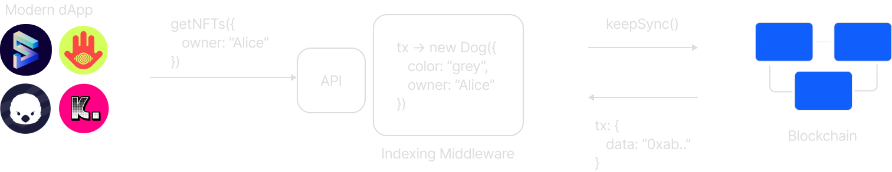
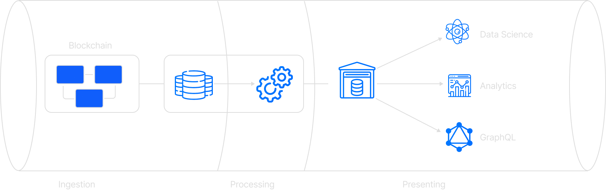
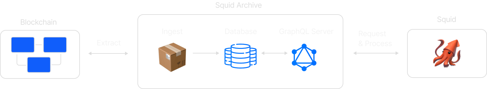
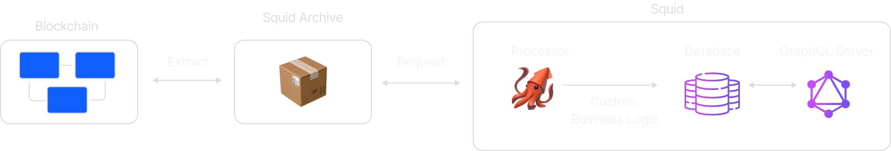

<!-- _backgroundImage: url(./bg.png) -->
<span class=title>

## Squid Development Deep Dive:

</span>

<span class=subtitle>

### 
### 
### 
### 

#### Let's Conquer the Giant Squid!

</span>

### 
### 
### 
### 

---

# Hello there 👋

### Massimo Luraschi

#### Developer Advocate @ subsquid.io

-  [@RaekwonIII](https://twitter.com/RaekwonIII) 
-  RaekwonIII#3962 
-  [@RaekwonTheChefIII](https://t.me/RaekwonTheChefIII) 
-  [RaekwonIII](https://github.com/RaekwonIII) 

---

<span class=subtitle>

### Indexing middleware

</span>



<span class=bulletpoint>

##### Ingest on-chain data
##### Data processing framework

</span>

---


<span class=subtitle>

### Why is middleware important

</span>

#### 📉 Minimize network requests
#### 📊 Minimize on-device storage
#### 💱 Seamlessly update 
#### ⛓️ Inherently multichain

---

<span class=subtitle>

### Modular Architecture

</span>



---

<span class=subtitle>

### Monolith

</span>

**Multiple uses, same ingestion**
**Potential replication**
**Wasted effort, resources**

<span class=subtitle>

### Modular

</span>

**Shared extraction services: Archives**

---
<span class=subtitle>

### Data flow

</span>



---
<span class=subtitle>

### Archives benefits

</span>

###### One less thing to **care about**
###### Better storage, **better performance**
###### **Filtering** batching
###### Reduced **network overhead**
###### Modularity ➡️ **future improvements**

---

<span class=subtitle>

### squids 🦑

</span>



---
<span class=subtitle>

### Subsquid SDK benefits

</span>

###### **Automated** model generation
###### Automated **ABI ➡️ code**
###### **Code** (TypeScript), not config
###### Strong typing/**type safety**
###### **Aquarium** - hosted service

---

<!-- _color: #105EFB -->
<span class="subtitle">

### From schema...
</span>

```graphql
type Owner @entity {
  id: ID!
  ownedTokens: [Token!]! @derivedFrom(field: "owner")
  balance: BigInt
}
```

---
<!-- _color: #105EFB -->

<span class="subtitle">

####
#### ...To Models
</span>

```typescript
@Entity_()
export class Owner {
  constructor(props?: Partial<Owner>) {
    Object.assign(this, props)
  }

  @PrimaryColumn_()
  id!: string

  @OneToMany_(() => Token, e => e.owner)
  ownedTokens!: Token[]

  @Column_("numeric", {transformer: marshal.bigintTransformer, nullable: true})
  balance!: bigint | undefined | null
}

```

---
<!-- _color: #105EFB -->

<span class="subtitle">

### From ABI...
</span>

```json
[
  // ...
  {
    "inputs": [
      { "internalType": "address", "name": "to", "type": "address" },
      { "internalType": "uint256", "name": "tokenId", "type": "uint256" }
    ],
    "name": "approve",
    "outputs": [],
    "stateMutability": "nonpayable",
    "type": "function"
  },
  // ...
]
```

---
<!-- _color: #105EFB -->

<span class="subtitle">

### …to TypeScript
</span>

```typescript
export const functions = {
    // ...
    approve: new Func<[to: string, tokenId: ethers.BigNumber], {to: string, tokenId: ethers.BigNumber}, []>(
        abi, '0x095ea7b3'
    ),
    // ...
}

const { _name } = functions.approve.decode(transaction.input);
```

---
<!-- _color: #105EFB -->

<span class="subtitle">

### Aquarium hosting service
</span>

```bash
npm i -g @subsquid/cli@latest
sqd deploy .
```

Visit [app.subsquid.io](https://app.subsquid.io/)

---
<!-- _color: #105EFB -->

<span class="subtitle">

### Resources

</span>

Docs [docs.subsquid.io](https://docs.subsquid.io)
GitHub [github.com/subsquid/](https://github.com/subsquid/)
YouTube [youtube.com/c/subsquid](https://www.youtube.com/channel/@subsquid)
Discord [discord.gg/subsquid](https://discord.gg/subsquid)
Telegram [t.me/HydraDevs](https://t.me/HydraDevs)
Medium [medium.com/subsquid](https://medium.com/subsquid)

---

<!-- .slide: data-background="https://i.imgur.com/4P35oA6.png" -->

<span class="subtitle">

# Giant Squids can be scary

</span>


---

<!-- .slide: data-background="https://i.imgur.com/4P35oA6.png" -->

<span class="subtitle">

# ...but they mean well

</span>

### [Let's dive!](https://github.com/subsquid-labs/giant-squid-stats/blob/feat/inflation-and-circulation/schema.graphql)


---

<!-- .slide: data-background="https://i.imgur.com/4P35oA6.png" -->

<!-- .slide: class="smol" -->
<!-- .slide: class="left" -->
<span class="subtitle">

# Setup

</span>

- Requisites: [Node.js](https://nodejs.org/en/download/) (16 or later), [Docker](https://docs.docker.com/get-docker/), [Subsquid CLI](https://docs.subsquid.io/squid-cli/)
- Create new project
- Install dependencies (plus new package for Frontier EVM)

```bash
sqd init storage-live-workshop
cd storage-live-workshop && npm i
```

select `substrate` template

---

<!-- .slide: data-background="https://i.imgur.com/4P35oA6.png" -->

<!-- .slide: class="smol" -->
<!-- .slide: class="left" -->
<span class="subtitle">

# Schema

</span>

Schema is fine, just add `balance` to `Account`

```graphql
type Account @entity {
  "Account address"
  id: ID!
  balance: BigInt!
  transfersTo: [Transfer!] @derivedFrom(field: "to")
  transfersFrom: [Transfer!] @derivedFrom(field: "from")
}

type Transfer @entity {
  id: ID!
  blockNumber: Int! @index
  timestamp: DateTime! @index
  extrinsicHash: String @index
  from: Account!
  to: Account!
  amount: BigInt! @index
  fee: BigInt! # fee is calculated at the best effort and may be zero for some old extrinsics
}

```

----

<!-- .slide: data-background="https://i.imgur.com/4P35oA6.png" -->

<!-- .slide: class="smol" -->
<!-- .slide: class="left" -->
<span class="subtitle">

# Codegen

</span>

- From project's root folder, launch `sqd codegen`
- Files will be re-generated


---

<!-- .slide: data-background="https://i.imgur.com/4P35oA6.png" -->

<!-- .slide: class="smol" -->
<!-- .slide: class="left" -->
<span class="subtitle">

# Substrate types

</span>

- Edit `typegen.json` 
- Edit `specVersions` ([Archive Registry repo](https://github.com/subsquid/archive-registry/blob/main/archives.json#L549))
- Specify `Balances.Transfer` in `events`
- Specify `Balances.Account` in `storage`
- From project root folder, launch:

```bash
sqd typegen
```

---

<!-- .slide: data-background="https://i.imgur.com/4P35oA6.png" -->

<span class="subtitle">

# Access on-chain storage

</span>

 - Request Account balances from storage
 - Build map to associate account to its balance

```typescript
async function getAccountBalances(ctx: Ctx, ownersIds: Set<string>) {
  const storage = new BalancesAccountStorage(ctx, ctx.blocks[ctx.blocks.length -1].header);
  const ownerAddresses = [...ownersIds]
  const ownerUintArrays = ownerAddresses.map((x) => new Uint8Array(decodeHex(x)));
  const accountsData = await storage.asV1050.getMany(ownerUintArrays);

  return new Map(ownerAddresses.map((v, i) => [v, accountsData[i].free]))
}
```

----

<!-- .slide: data-background="https://i.imgur.com/4P35oA6.png" -->

<span class="subtitle">

# Assign balance to accounts

</span>

```typescript
const accountsData = await getAccountBalances(ctx, accountIds);
for (let t of transfersData) {
  let { id, blockNumber, timestamp, extrinsicHash, amount, fee } = t;

  let from = getAccount(accounts, t.from);
  from.balance = accountsData.get(from.id) || 0n
  let to = getAccount(accounts, t.to);
  to.balance = accountsData.get(to.id) || 0n
  // ...
}
```

---

<!-- .slide: data-background="https://i.imgur.com/4P35oA6.png" -->

<!-- .slide: class="smol" -->
<!-- .slide: class="left" -->
<span class="subtitle">

## Database

</span>

- A **squid** need a database to store processed data
- Templates have `docker-compose.yml` file to launch a container
- From project's root folder, launch  `sqd up`

---

<!-- .slide: data-background="https://i.imgur.com/4P35oA6.png" -->

<!-- .slide: class="smol" -->
<!-- .slide: class="left" -->

<span class="subtitle">

## Database migration

</span>

- Clean up existing migrations

```bash
sqd migration:clean
```

- Create new migration (will build code)

```bash
sqd migration
```

---

<!-- .slide: data-background="https://i.imgur.com/4P35oA6.png" -->

<!-- .slide: class="smol" -->
<!-- .slide: class="left" -->
<span class="subtitle">

## Launch the project

</span>

- Launch the Processor (will lock the console window)

```bash
sqd process
```

- Launch the GraphQL server (in another console window)

```bash
sqd serve
```

- Open the browser at http://localhost:4350/graphql

---

<!-- .slide: data-background="https://i.imgur.com/4P35oA6.png" -->

<span class="subtitle">

# What's next?

</span>

### Proxies, proxies everywhere


---

<!-- .slide: data-background="https://i.imgur.com/4P35oA6.png" -->

<span class="subtitle">

# Proxy accounts

### [From Polkadot docs](https://wiki.polkadot.network/docs/learn-proxies)

</span>

> Proxies allow users to use an account less frequently but actively participate in the network with the weight of the tokens in that account.

 
> Proxies are allowed to perform a limited amount of actions related to specific substrate pallets on behalf of another account

---

<!-- .slide: data-background="https://i.imgur.com/4P35oA6.png" -->

<span class="subtitle">

# Thank you 🦑

</span>

Follow the project on GitHub
https://github.com/subsquid/squid


Give us a ⭐, more Alpha coming soon™️

---
<!-- _color: #105EFB -->

<span class="subtitle">

### Shameless plug

</span>

* Medium [medium.com/subsquid](https://medium.com/subsquid)
* YouTube [youtube.com/c/subsquid](https://www.youtube.com/channel/@subsquid)
* Docs [docs.subsquid.io](https://docs.subsquid.io)
* GitHub [github.com/subsquid/](https://github.com/subsquid/)
* Discord [discord.gg/subsquid](https://discord.gg/subsquid)
* Telegram [t.me/HydraDevs](https://t.me/HydraDevs)
